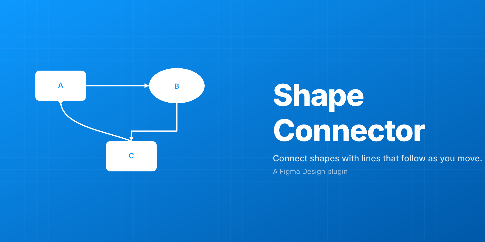

# Shape Connector

A Figma **Design** plugin that connects any shape to any other shape with a line that stays attached when you move the shapes.

<p align="center">
  
</p>

## Features

- **Connect any shapes** — select two or more shapes and click **Connect**. Connectors are drawn as a chain: `A → B → C → …`.
- **Lines that follow** — connectors auto-reroute as you drag shapes around (~20× per second), and snap into final position the moment you release.
- **Three line styles** — Orthogonal (right-angle), Curved (S-bezier), or Straight.
- **Six endpoint shapes per end** — None, Arrow, Filled circle, Hollow circle, Filled square, Hollow square. Source and target are configured independently.
- **Per-connector styling** — color, line width (0.5–20 px), endpoint size (4–60 px). All controls work on a single selected connector or a multi-selection.
- **Editing existing connectors** — select any connector on the canvas; the panel switches into "Editing N connectors" mode and any control change applies to the selection.
- **Minimize to corner** — collapse the UI to a slim strip docked at the bottom-right of the viewport, so the plugin can keep running while you work.
- **Persistent across sessions** — connections are stored in the file (`figma.root.pluginData`), so they survive plugin reload and reopening the file.

## Install

### From source (development)

You need [Node.js](https://nodejs.org/) (16+) and the [Figma desktop app](https://www.figma.com/downloads/). The in-browser editor doesn't load local plugins.

```sh
git clone https://github.com/guzforster/shape-connector.git
cd shape-connector
npm install
npm run build
```

Then in Figma desktop:

1. **Menu → Plugins → Development → Import plugin from manifest…**
2. Pick `manifest.json` from this folder.
3. The plugin appears under **Plugins → Development → Shape Connector**.

### From the Figma Community

*Coming soon — this plugin is being prepared for Community submission.*

## Use

1. Open any Figma Design file and run the plugin.
2. Select **two or more shapes** on the canvas.
3. (Optional) Pick a line style, endpoint shapes, color, line width, and endpoint size in the panel.
4. Click **Connect selected shapes**.

To **edit** a connector after creating it: click the connector group on the canvas. The panel header switches to "Editing 1 connector" and reflects its current style. Change any control to apply the new style in place.

To **delete** a connector: select it and click **Delete selected connectors**.

To **minimize**: click the `_` button at the top-right of the panel. It collapses to a thin strip in the bottom-right corner and keeps running in the background.

## How it works

A connector is a `GroupNode` parented at the page level, containing:

- 1 `VectorNode` — the routed line itself
- 0–2 cap nodes — either `EllipseNode` (circles), `RectangleNode` (squares), or `VectorNode` (custom-drawn triangles for arrows). Caps are independent shapes so their size can be controlled separately from the line's stroke weight.

The plugin maintains a list of `{ groupId, lineId, startCapId, endCapId, sourceShapeId, targetShapeId, … }` records on `figma.root.pluginData`. A 50 ms polling loop walks the list, compares each endpoint shape's `absoluteBoundingBox` against the previous tick, and only reroutes the connectors whose endpoints actually moved.

When a connector is rerouted, the line's `vectorPaths` is rewritten with fresh path data computed from the current shape positions, and each cap is repositioned (and rotated, for arrows) at the endpoint with the correct tangent direction.

## Project layout

```
manifest.json     Figma plugin manifest
code.ts           Plugin sandbox code (compiles to code.js)
code.js           Compiled output — what Figma actually loads
ui.html           Plugin panel UI
tsconfig.json     TypeScript config
package.json      npm scripts + Figma plugin typings
assets/
  icon.svg        128x128 plugin icon
  cover.svg       1920x960 cover image for the Community listing
```

## Development

```sh
npm run watch     # rebuild code.js on every save
```

Reload the plugin in Figma after each rebuild — either re-run it from the Plugins menu, or use `Ctrl+Alt+P` (Windows) / `Cmd+Option+P` (Mac) to rerun the last plugin.

## Roadmap

- [ ] Labels on connectors (text along or beside the line)
- [ ] Multiple routing flavours for orthogonal (e.g. avoid other shapes)
- [ ] "Connect all-pairs" mode in addition to the current chain
- [ ] Dashed/dotted stroke styles
- [ ] Per-end arrow style variants (filled vs. outlined)

## Contributing

Bug reports and pull requests welcome at <https://github.com/guzforster/shape-connector/issues>.

## License

[MIT](LICENSE) © Gustavo Forster
