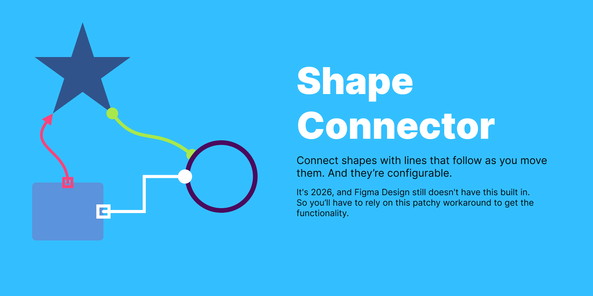

# Shape Connector

> **Beta — v0.3.0.** This plugin is in active development. Expect rough edges, breaking changes between versions, and the occasional bug. Feedback and issue reports are very welcome.

A Figma plugin that connects any shape to any other shape with a line that stays attached when you move the shapes.

<p align="center">
  
</p>

## Features

- **Connect any shape** — select two or more shapes and click **Connect**. Connectors are drawn as a chain: `A → B → C → …`.
- **Lines that follow** — connectors auto-reroute as you drag shapes around and snap into final position the moment you release.
- **Three line styles** — Orthogonal (right-angle), Curved (S-bezier), or Straight.
- **Eight endpoint shapes per end** — None, Arrow, Filled/Hollow circle, Filled/Hollow square, Filled/Hollow semi-circle. Source and target are configured independently.
- **Per-connector styling** — color, line width (0.5–20 px), endpoint size (4–60 px). All controls work on a single selected connector or a multi-selection.
- **Labels** — add a text label to any connector. The label tracks the line's midpoint and rides a white pill so the line behind it stays readable. Use Figma's native text panel to change font, size, weight, or color. Empty the label's text to delete it.
- **Saved styles** — capture a connector's full look (line + endpoints + color + width + text properties if labeled) as a reusable preset, then apply it back with one click. 
- **Editing existing connectors** — select any connector and the panel switches into "Editing N connectors" mode. Any control change applies to the selection. Selecting a *shape* puts every connector attached to it in scope too, so you can restyle every line touching a node in one move.
- **Minimize to corner** — collapse the UI to a slim strip docked at the bottom-right of the viewport. Figma plugins can't run in the background — they stop the moment their window is closed — so the connectors only keep tracking your shapes while the plugin is open. Minimize lets the plugin stay alive (and the connectors keep following your shapes) without taking up screen space.
- **Persistent across sessions** — connections and saved styles live in the file (`figma.root.pluginData`), so everything survives plugin reload and reopening. If you move shapes around while the plugin is closed, the lines may visually appear stuck — but they're not lost. As soon as you reopen the plugin it re-finds every connected shape by its ID and snaps the connectors back into place.

## Install

### From source (development)

You need [Node.js](https://nodejs.org/) (16+) and the [Figma desktop app](https://www.figma.com/downloads/). The in-browser editor doesn't load local plugins.

```sh
git clone https://github.com/guzforster/shape-connector.git
cd shape-connector
npm install
npm run build
```

Then in Figma desktop:

1. **Menu → Plugins → Development → Import plugin from manifest…**
2. Pick `manifest.json` from this folder.
3. The plugin appears under **Plugins → Development → Shape Connector**.

### From the Figma Community

*Coming soon — this plugin is being prepared for Community submission.*

## Use

### Connect shapes

1. Open any Figma Design file and run the plugin.
2. Select **two or more shapes** on the canvas.
3. (Optional) Pick a line style, endpoint shapes, color, line width, and end size in the panel.
4. Click **Connect selected shapes**.

### Edit a connector

Click a connector on the canvas — the panel header switches to **"Editing 1 connector"** and the controls reflect its current style. Change any control to apply the new style in place. To restyle multiple connectors at once, select any combination of connectors *or* shapes that connect to them.

### Add and remove labels

With a connector (or shape with attached connectors) selected, click **Add label**. A "Label" text appears at the line's midpoint with a white pill behind it. Double-click into the group to edit the text using Figma's native text controls. Empty the text and click off — the label and pill are removed automatically.

The button doubles as **Remove label** when every selected connector already has one.

### Save and reuse styles

Use the **Styles** section to save and apply presets:

- Click **+** with nothing selected → saves the current control values as a preset.
- Click **+** with a connector selected → saves that connector's exact style (including its label's font/size/color, if any).
- Click **+** with multiple connectors selected → saves one preset per connector.
- Click an existing preset to apply it to whatever is in scope (or to set as the defaults for the next Connect, if nothing is selected).
- Hover a preset and click **×** to delete it.

The preset thumbnail mirrors the saved line style — diagonal for straight, an L-shape for orthogonal, an S-curve for curved.

### Delete a connector

Select it and click **Delete selected connectors**.

### Minimize

Click the **_** button at the top-right of the panel. It collapses to a thin strip docked in the bottom-right corner. The plugin stays open in this slim form so the connectors keep following your shapes — Figma plugins stop the moment their window is closed, so the panel has to remain visible (in some form) to keep the routing alive.

## Project layout

```
manifest.json     Figma plugin manifest
code.ts           Plugin sandbox code (compiles to code.js)
code.js           Compiled output — what Figma actually loads
ui.html           Plugin panel UI
tsconfig.json     TypeScript config
package.json      npm scripts + Figma plugin typings
assets/
  icon.png        128x128 plugin icon
  cover.png       1920x960 cover image for the Community listing
```

## Development

```sh
npm run watch     # rebuild code.js on every save
```

Reload the plugin in Figma after each rebuild — either re-run it from the Plugins menu, or use `Ctrl+Alt+P` (Windows) / `Cmd+Option+P` (Mac) to rerun the last plugin.

## Roadmap

- [ ] Per-end arrow style variants (filled vs. outlined triangles)
- [ ] Dashed/dotted stroke styles
- [ ] Smarter orthogonal routing that avoids other shapes
- [ ] "Connect all-pairs" mode in addition to the current chain

## Contributing

Bug reports and pull requests welcome at <https://github.com/guzforster/shape-connector/issues>.

## License

[MIT](LICENSE) © Gustavo Forster
